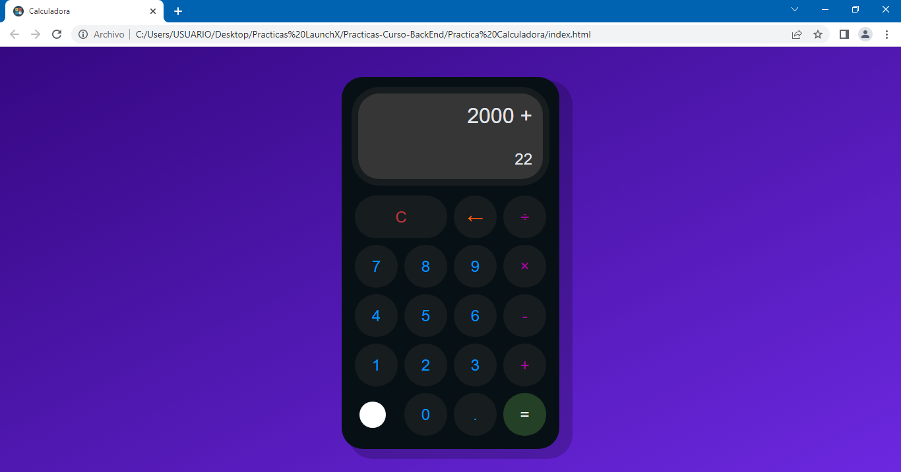

# Practica Calculadora :iphone:

Uno de los primeros ejercicios de todo curso de programación es hacer una calculadora ya que te permite aprender:

- Concatenación
- Operaciones matemáticas
- Uso de variables
- Entrada del usuario
- Muestra de resultados al usuario

Para esta practica se debe hacer una calculadora con las siguientes operaciones:
- Suma
- Resta
- Multiplicación
- División
- Borrar todos los datos de la calculadora

- Todo debe ser con botones e inputs HTML. Nada en consola.

## Te dejo algunas capturas de pantalla de la calculadora

***También puedes ir al link directo, ¡vamos vela tú mismo! :eyes: :point_right: [LINK](https://charliecrown.github.io/Calculadora/)***

[Volver al menú &ldca;](../README.md "Regresar a página principal")