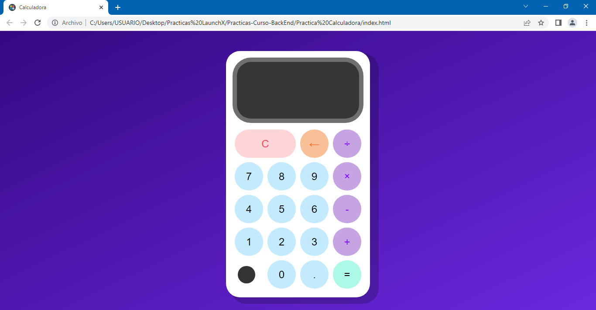

# Repositorio para todas las practicas del curso BackEnd de InnovAccion Virtual LaunchX :man_astronaut: :rocket:
Bienvenidos a mi repositorio de prácticas de BackEnd, en el encontraras practicas con HTML, CSS, JAVASCRIPT, Node.js, Express, Socket, MySQL y MongoDB :wink:	

## 1.- Practica Amarre :heart:	
Esta es la primer practica del curso de BackEnd. El proyecto por realizar fue un "Amarre", es decir una propuesta de noviazgo, es una práctica muy divertida de hacer, es un proyecto sencillo ya que el objetivo es aprender lo básico de JavaScript.

Tecnologías empleadas:

- HTML
- CSS
- JavaScript
- GitHub

***¡Adelante échale un vistazo! :eyes: :point_right: [VER](./)***

## 2.- Practica Calculadora :iphone:
Para esta segunda practica del curso, toco realizar una calculadora, esto con el fin de repasar la parte del HTML, CSS y reforzar lo aprendido hasta el momento de JavaScript, es un proyecto sencillo, pero bastante útil para mejorar la lógica de programación.

Tecnologías empleadas:

- HTML
- CSS
- JavaScript
- GitHub

***¡Adelante échale un vistazo! :eyes: :point_right: [VER](./Practica%20Calculadora/README.md)***

